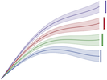

# The pyam package at the *Strommarkttreffen* seminar


[](https://github.com/IAMconsortium/pyam)
[](https://github.com/psf/black)

Copyright 2021 Daniel Huppmann; this repository is released under the [MIT License](LICENSE). 

## Overview

This repository holds a Jupyter notebook for a live-demo of the **pyam** package
given as part the *Strommarkttreffen-Online* seminar series on July 14, 2021.

The Jupyter notebook is based on the advanced assignment
of the [Modelling Lab](https://github.com/danielhuppmann/climate-risks-academy-2021),
which was part of the *Climate Risks Academy 2021* organized by
the European University Institute (EUI) Florence School of Banking and Finance
in cooperation with Oliver Wyman.

The scenario data used in this tutorial notebook is taken from
the [NGFS Scenario Explorer hosted by IIASA](https://data.ece.iiasa.ac.at/ngfs),
Phase 2 (June 2021).

The slides for the presentation are available
at the DOI [10.22022/IACC/07-2021.17319](https://doi.org/10.22022/IACC/07-2021.17319).

See https://www.strommarkttreffen.org/online/ for more about the *Strommarkttreffen* (in German).

## The pyam package



This exercise uses the Python package **pyam**, an open-source community toolbox for
analysis & visualization of scenario data.
The package was developed to facilitate working with timeseries scenario data
conforming to the format developed by the
[Integrated Assessment Modeling Consortium (IAMC)](https://www.iamconsortium.org).
The package is used in ongoing assessments by the IPCC and in many model comparison
projects at the global and national level, including several Horizon 2020 projects.

[Read the docs](https://pyam-iamc.readthedocs.io) for more information!

## Getting started

To run the notebooks on your machine, please install Python version 3.7 or higher.
To install the required packages and dependencies, download or git-clone this repository
and run the following command in the root folder:

```
pip install -r requirements.txt
```
